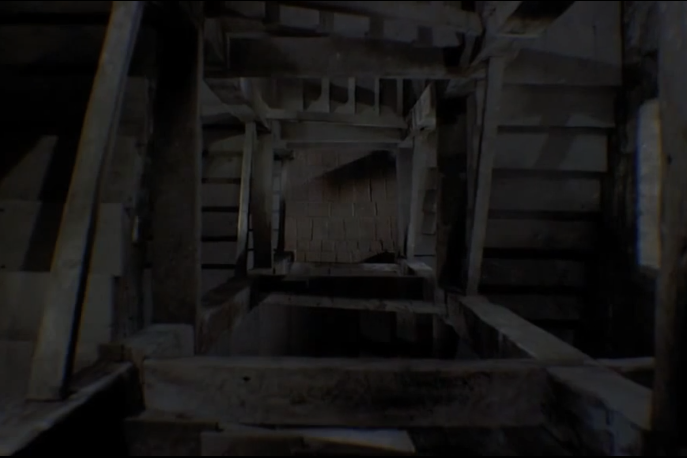
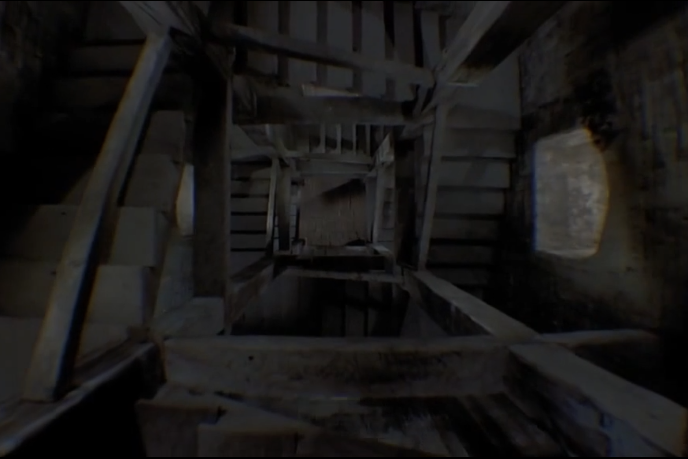
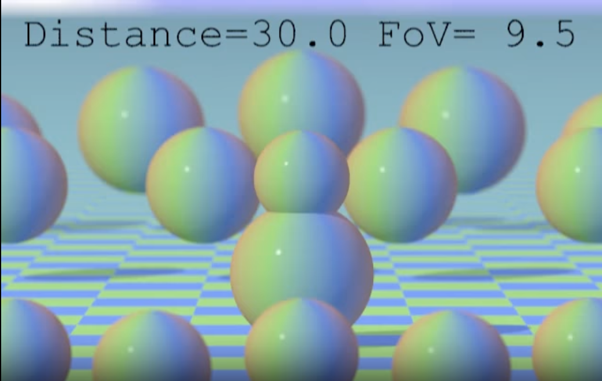
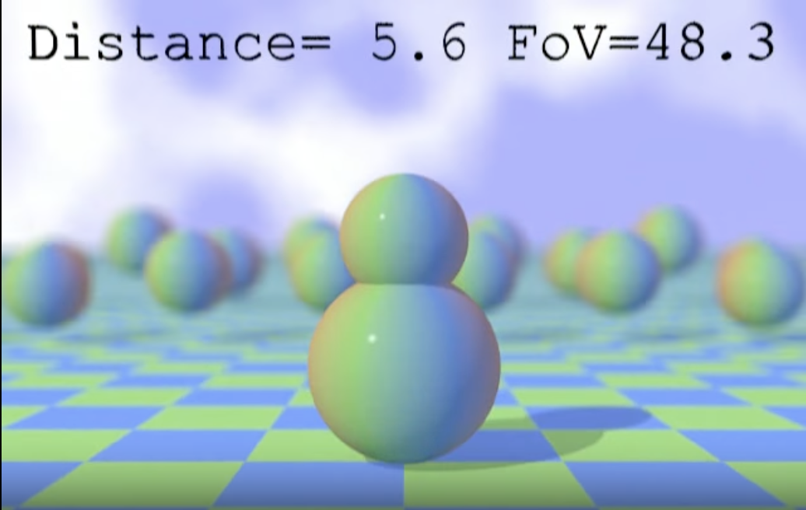

# Week 9 Quiz
yzho0969_9103_tut5

## **Imaging Technique Inspiration**
The dolly zoom (also known as the Hitchcock zoom) was used extensively in Alfred Hitchcock's film Vertigo. It creates a surreal, unsettling shift in perspective by zooming the lens and moving the camera in the opposite direction. It is a powerful visual storytelling tool.

## **Coding Technique Exploration**
To digitally recreate the dolly zoom, the manipulation of the camera's field of view (FOV) and Z position was explored using Three.js. This was done by dynamically adjusting the camera's field of view as it moved forward and backward.

[Reference 1](https://www.noveltech.dev/unity-dolly-zoom-effect)

[Reference 2](https://github.com/LoongZP/threejs-DollyZoom)

